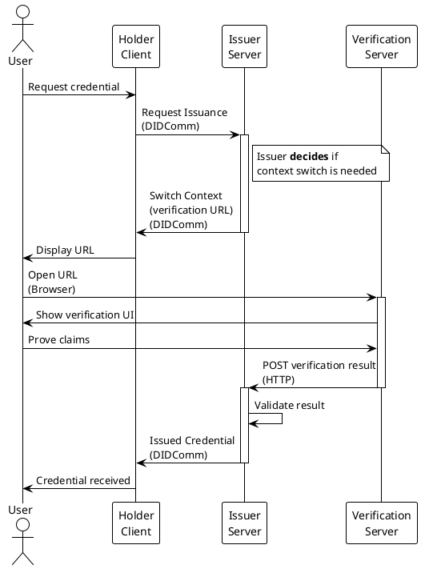

# Browser Context Switch Example with HTTP Servers

This example demonstrates the complete browser context switch flow for credential issuance using VDIP (Verifiable Data Issuance Protocol) with real HTTP servers.

## What is Context Switching?

**Context switching** is an optional feature in VDIP that allows the credential issuance flow to temporarily transition from the DIDComm messaging channel to an alternative context, such as a web browser. This enables:

- **User interaction**: Collecting consent, displaying terms, or performing identity verification in a familiar web interface
- **Third-party verification**: Integrating with external verification services (KYC providers, OAuth providers, biometric systems)
- **Enhanced security**: Performing additional authentication steps before credential issuance
- **Rich UI experiences**: Showing complex forms or media that would be difficult in a pure DIDComm flow

### When to Use Context Switching

Context switching is **optional** and should be used strategically:

**Use context switching when:**

- Additional user verification or consent is required (e.g., email verification, phone verification)
- Integration with third-party verification services is needed (e.g., KYC providers, government ID verification)
- Complex user interactions are necessary (e.g., reviewing terms and conditions, filling out forms)
- Browser-based authentication is preferred (e.g., OAuth, OIDC flows)

**Skip context switching when:**

- The credential can be issued immediately based on the request data
- All necessary verification was completed before the VDIP flow started
- The issuer has sufficient information to issue the credential directly
- Low-friction issuance is desired for simple credential types

### How It Works

1. **Holder** sends a credential request via DIDComm
2. **Issuer** evaluates the request and **decides** whether context switching is needed
3. If needed, **Issuer** sends a `switch-context` message with a verification URL
4. **Holder** opens the URL in a browser (or embedded web view)
5. User completes the browser-based verification/interaction
6. Browser context sends results back to the **Issuer**
7. **Issuer** validates the results and issues the credential via DIDComm
8. **Holder** receives the verifiable credential through the original DIDComm channel

## Overview

The example showcases a realistic scenario where:

1. **Holder** requests a credential from an **Issuer**
2. **Issuer** determines that browser-based verification is needed (context switch decision)
3. **Issuer** sends a Switch Context message with a verification URL
4. **Holder** receives the URL and opens it in a browser
5. The URL redirects to a **Verification Server** (3rd party) with a simple HTML UI
6. User approves/declines the verification request via a button
7. **Verification Server** sends the result back to **Issuer Server**
8. **Issuer** validates the verification result and issues the credential
9. **Holder** receives the verifiable credential

## Architecture



**Components:**

- **Holder Client** (DIDComm): Requests credentials and receives issued VCs using DIDComm
- **Issuer Server** (DIDComm + HTTP port 8080): Decides when to trigger context switch, handles verification callbacks, issues credentials. It runs a web server on port 8080 with webhook, triggered by Verification Server after Holder successfully finishes verification. Webhook can be implemented according to <https://devdocs.veriff.com/docs/webhooks-guide> and <https://github.com/Veriff/js-integration-demo>.
- **Verification Server** (HTTP port 8081): Third-party service for user verification with web UI, provides utilities for verification and claims proofs.

## Prerequisites

1. **Generate cryptographic keys** for Holder and Issuer:

   ```bash
   cd libs/dart/didcomm/vdip

   # Create keys directory if it doesn't exist
   mkdir -p example/keys

   # Generate Issuer key (Alice)
   openssl ecparam -name prime256v1 -genkey -noout -out example/keys/alice_private_key.pem

   # Generate Holder key (Bob)
   openssl ecparam -name prime256v1 -genkey -noout -out example/keys/bob_private_key.pem
   ```

2. **Set up a DIDComm mediator**:
   - Option A: Use [Affinidi Portal](https://portal.affinidi.com)
   - Option B: Run [affinidi-tdk-rs mediator](https://github.com/affinidi/affinidi-tdk-rs/tree/main/crates/affinidi-messaging/affinidi-messaging-mediator)

   After setting up, copy the mediator's DID into:

   ```bash
   mkdir -p example/mediator
   echo "did:peer:..." > example/mediator/mediator_did.txt
   ```

## Running the Example

```bash
cd libs/dart/didcomm/vdip
dart run example/browser_context_with_servers_example.dart
```

### What to Expect

1. **Server Startup**:

   ```text
   Servers started:
      - Issuer Server: http://localhost:8080
      - Verification Server: http://localhost:8081
   ```

2. **Flow Initiation**:

   ```text
   STARTING BROWSER CONTEXT SWITCH FLOW
   Holder: Initiating credential request...
   ```

3. **Switch Context**:

   ```text
   Holder: Received Switch Context Message
   Holder: Browser context URL built

   ================================================================================
   BROWSER OPEN
      In a real app, this URL would open in a browser:
      http://localhost:8080/vdip/issuance?token=eyJ...
   ================================================================================
   ```

4. **Verification Page**:

   ```text
   Verification Server: Serving verification page

   ================================================================================
   BROWSER VERIFICATION PAGE
      Please open: http://localhost:8081/verify?token=eyJ...
      Or run: open "http://localhost:8081/verify?token=eyJ..."
   ================================================================================
   ```

   The page will:

   - Display verification details
   - Show approve/deny buttons
   - Auto-submit after 3 seconds (for demo purposes)

5. **Verification Callback**:

   ```text
    Issuer Server: Verification callback received
      - Nonce: abc-123-xyz
      - Verified: true

    Issuer: Verification successful! Issuing credential...
   ```

6. **Credential Issuance**:

   ```text
   Holder: CREDENTIAL RECEIVED!

   SUCCESS! The complete flow is finished:
     1. ✓ Holder requested credential
     2. ✓ Issuer sent switch context
     3. ✓ Browser verification completed
     4. ✓ Issuer validated and issued credential
     5. ✓ Holder received credential

   ```

## Flow Details

### 1. Initial Credential Request

The Holder sends a credential request without a nonce:

```dart
await holderClient.requestCredential(
  issuerDid: issuerSigner.did,
  options: RequestCredentialsOptions(
    proposalId: 'proposal_browser_verification',
    credentialMeta: CredentialMeta(
      data: {'email': 'holder@example.com'},
    ),
  ),
);
```

### 2. Switch Context Initiation

The Issuer determines verification is needed and sends a switch context message:

```dart
await issuerClient.sendSwitchContext(
  holderDid: message.from!,
  baseIssuerUrl: Uri.parse('http://localhost:8080'),
  nonce: contextNonce,
  threadId: threadId,
);
```

### 3. Browser Context URL Building

The Holder builds a verification URL with a JWT token:

```dart
final verificationUrl = await holderClient.buildBrowserContextUrl(
  switchContextMessage: message,
);
// Returns: http://localhost:8080/vdip/issuance?token=eyJ...
```

### 4. Verification Flow

- Issuer Server redirects to Verification Server
- User sees HTML verification page
- User clicks Approve/Deny
- Result is sent back to Issuer Server via POST

### 5. Credential Issuance

After successful verification, the Issuer issues a credential:

```dart
final unsignedCredential = VcDataModelV1(
  // ... credential details
  credentialSubject: [
    CredentialSubject.fromJson({
      'id': holderDid,
      'email': email,
      'verified': true,
      'verificationMethod': 'browser_context_switch',
    }),
  ],
);
```
