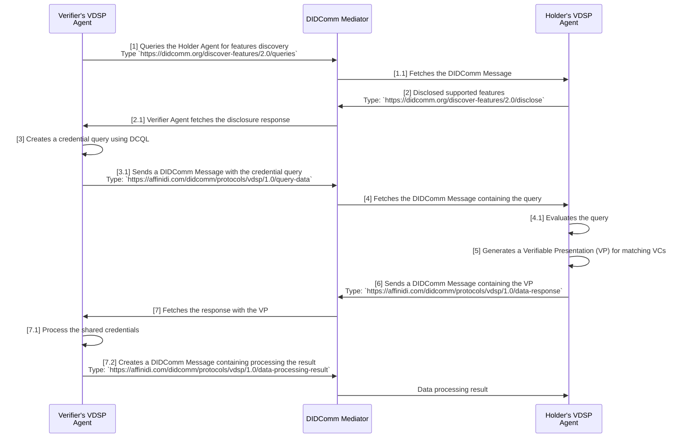

# Verifiable Data Sharing Protocol

This document describes protocols implemented in the scope of `Verifiable Data Sharing Protocol` workflow.

## Table of Contents

- [Summary](#summary)
- [Motivation](#motivation)
- [Roles](#roles)
  - [Verifier](#verifier)
  - [Holder](#holder)
- [States](#states)
- [Security](#security)
- [Workflow](#workflow)
- [Messages](#messages)
  - [query-data](#query-data)
  - [data-response](#data-response)
  - [data-processing-result](#data-processing-result)
- [Error Models](#error-models)
- [Other Protocols](#other-protocols)
  - [Discover Features Protocol 2.0](#discover-features-protocol-20)
  - [Report Errors or Warnings Protocol](#report-errors-or-warnings-protocol)
- [Implementation](#implementation)

## Summary

The Verifiable Data Sharing Protocol (VDSP) facilitates the secure and interoperable exchange of verifiable credentials between **Holders** and **Verifiers** using the DIDComm v2.1 protocol.

## Motivation

To enable a secure and trusted data sharing between Holders and Verifiers using DIDComm-compatible mediators.

## Roles

There are two roles in the VDSP flow:

### Verifier

An entity that requests verifiable credentials from holders. The verifier can query holders for specific data using credential query language and verify the authenticity of the shared credentials.

### Holder

An entity that stores and controls verifiable credentials. The holder can receive data requests, filter their credentials, and share selected credentials with verifiers through a verifiable presentation format.

## States

The protocol follows the request-response pattern of message exchange, where it waits for a response from the Holder, especially when querying data.

The Verifier **MUST** send the `data-processing-result` to inform the Holder of the outcome after sharing the data.

## Security

The protocol requires that all message exchanges between the Verifier and the Holder **MUST** be encrypted and verifiable to ensure confidentiality, integrity, and authenticity.

- All messages **MUST** use `authcrypt` encryption envelope (e.g., `authcrypt(signed(plaintext))` or `authcrypt(plaintext)`) to verify the sender and the content remains confidential throughout transmission.

- The Verifier **MUST** cryptographically verify the digital signatures of Verifiable Credentials (VCs) and Verifiable Presentations (VPs) shared by the Holder.

## Workflow

When initiating the data-sharing flow, it usually takes the following steps:



1. **Feature Query Initiation**

    The Verifier **MAY** send a message to the Holder requesting information about supported features ([`discover-features/2.0/queries`](#querying-features)).

2. **Feature Disclosure**
    
    The Holder **MAY** respond with a message listing the supported features ([`discover-features/2.0/disclose`](#feature-disclosures)).

3. **Credential Query Request**

    If the desired feature is supported, the Verifier **MUST** send a message containing a credential query to request specific credentials from the Holder’s digital wallet ([`vdsp/1.0/query-data`](#query-data)).

4. **Credential Evaluation**

    The Holder retrieves the message and evaluates the credential query to identify matching credentials in the digital wallet.

5. **Verifiable Presentation Generation**

    If matching credentials exist, the wallet **MUST** generate a Verifiable Presentation (VP) signed with the Holder’s Decentralised Identifier (DID).

6. **Presentation Delivery**

    The Holder **MUST** send a message back to the Verifier containing the Verifiable Presentation ([`vdsp/1.0/data-response`](#data-response)).

7. **Verification and Processing**
   
    Upon receiving the VP, the Verifier **MUST** cryptographically verifies the credentials, processes the data for its intended purpose, and the Verifier **MUST** send the result back to the Holder ([`vdsp/1.0/data-processing-result`](#data-processing-result)). 

## Messages

VDSP implements the following message types.

### query-data

Request Verifiable Credentials (VCs) from Verifier to Holder using Digital Credentials Query Language (DCQL).

**Direction:** Verifier → Holder

**Message Type URI:** 

```
https://affinidi.com/didcomm/protocols/vdsp/1.0/query-data
```

**Message Fields:**

- **`operation` REQUIRED:** The operation to use by the Verifier based on the supported operation of the Holder's agent.

- **`data_query_lang` REQUIRED:** The query language to use to request data from the Holder's digital wallet. The sample implemention of this protocol supports DCQL defined within the [OID4VP specification](https://openid.net/specs/openid-4-verifiable-presentations-1_0.html#name-digital-credentials-query-l).

- **`query` REQUIRED:** The query that adheres to the syntax of the selected `data_query_lang`. The sample implementation of this protocol uses a query that adheres to the format defined in DCQL within the [OID4VP specification](https://openid.net/specs/openid-4-verifiable-presentations-1_0.html#name-digital-credentials-query-l).

- **`proof_context` REQUIRED:** Contains a random challenge string and the domain of the Verifier to prevent replay attacks.
  - `challenge`: A unique random string used to verify the request.
  - `domain`: The domain of the Verifier for verifying the request origin.

- **`response_format` REQUIRED:** The format of the data to be returned to the Verifier (e.g., application/json)

- **`comment` OPTIONAL:** An optional comment about the request from the Verifier.

**Example:**

```json
{
  "id": "12461308-57e4-400b-a3ad-1ba3a2bf3fe2",
  "type": "https://affinidi.com/didcomm/protocols/vdsp/1.0/query-data",
  "from": "did:webvh:QmQfsx1wNZYpVxjWwMnUj16rDH2dq8UbcsC1igZMR23k9z:verifierdomain.com",
  "to": [
    "did:key:Vz6MkhA4WiEoTaSXmShG4s2mpYsWku2km2MaLq1m2g3yReZF7"
  ],
  "body": {
    "operation": "registerAgent",
    "data_query_lang": "DCQL",
    "response_format": "application/json",
    "query": {
      "credentials": [
        {
          "id": "46abedea-472e-48d3-aaff-3def8ae88e44",
          "format": "ldp_vc",
          "multiple": false,
          "require_cryptographic_holder_binding": true,
          "claims": [
            {
              "path": [
                "credentialSubject",
                "email"
              ]
            }
          ]
        }
      ]
    },
    "proof_context": {
      "challenge": "ae34c9ed-e741-4cd2-90a2-378b05004fa5",
      "domain": "verifierdomain.com"
    }
  }
}
```

In the example above, the **`query`** property adheres to the format defined in DCQL within the [OID4VP specification](https://openid.net/specs/openid-4-verifiable-presentations-1_0.html#name-digital-credentials-query-l). 

### data-response

Shares the presentation of the Verifiable Credentials (VCs) from Holder to Verifier using Verifiable Presentation (VP) format, cryptographically signed by the holder.

**Direction:** Holder → Verifier

**Message Type URI:**

```
https://affinidi.com/didcomm/protocols/vdsp/1.0/data-response
```

**Message Fields:**

- **`data_query_lang` REQUIRED:** The query language to use to request data from the Holder's digital wallet. The sample implementation of this protocol supports DCQL defined within the [OID4VP specification](https://openid.net/specs/openid-4-verifiable-presentations-1_0.html#name-digital-credentials-query-l).

- **`data_response` REQUIRED:** Contains the Verifiable Presentation (VP) of the shared credentials from the Holder's digital wallet.

- **`response_format` REQUIRED:** The format of the data to be returned to the Verifier (e.g., application/json)

- **`comment` OPTIONAL:** An optional comment about the request from the Holder.


**Example:**

```json
{
  "id": "13c8e304-cc5c-4a2f-90d9-cbc939bfe67f",
  "type": "https://affinidi.com/didcomm/protocols/vdsp/1.0/data-response",
  "from": "did:key:Vz6MkhA4WiEoTaSXmShG4s2mpYsWku2km2MaLq1m2g3yReZF7",
  "to": [
    "did:webvh:QmQfsx1wNZYpVxjWwMnUj16rDH2dq8UbcsC1igZMR23k9z:verifierdomain.com"
  ],
  "body": {
    "data_query_lang": "DCQL",
    "response_format": "application/json",
    "data_response": {
      "@context": [
        "https://www.w3.org/ns/credentials/v2"
      ],
      "id": "3fcdee5b-3451-4ffd-ba70-d9cc11f645b4",
      "type": [
        "VerifiablePresentation"
      ],
      "holder": {
        "id": "did:key:Vz6MkhA4WiEoTaSXmShG4s2mpYsWku2km2MaLq1m2g3yReZF7"
      },
      "verifiableCredential": [
        {
          "@context": [
            "https://www.w3.org/2018/credentials/v1",
            "https://schema.affinidi.io/TEmailV1R0.jsonld"
          ],
          "issuer": {
            "id": "did:webvh:QmQfsx1wNZYpVxjWwMnUj16rDH2dq8UbcsC1igZMR2387h:issuerdomain.com"
          },
          "type": [
            "VerifiableCredential",
            "Email"
          ],
          "id": "1c471d4e-a739-400c-a1c8-2e44a6bb524f",
          "credentialSchema": {
            "id": "https://schema.affinidi.io/TEmailV1R0.json",
            "type": "JsonSchemaValidator2018"
          },
          "issuanceDate": "2025-11-12T09:09:30.954818Z",
          "credentialSubject": {
            "id": "did:key:Vz6MkhA4WiEoTaSXmShG4s2mpYsWku2km2MaLq1m2g3yReZF7",
            "email": "user@test.com"
          },
          "proof": {
            // Removed for brevity
          }
        }
      ],
      "proof": {
        // Removed for brevity
    }
  }
}
```

In the example above, the **`data_response`** property contains the Verifiable Presentation (VP) of the shared credentials from the Holder.

#### Data Response Validation by Verifier

The Verifier MUST validate the data shared by the Holder by performing the following steps:

1. The Verifier **MUST** resolve the `holder_did` to obtain its DID Document.

2. The Verifier **MUST** verify the digital signature of the Verifiable Presentation (VP) using the public key from the Holder’s DID Document.

3. For every Verifiable Credential (VC) included in the VP, the Verifier **MUST** resolve the Issuer’s DID to obtain its DID Document.

4. The Verifier **MUST** verify the digital signature of each VC to ensure tamper-evidence and authenticity using the Issuer’s public key from the Issuer’s DID Document.

5. The Verifier **MUST** check whether each VC has expired or been revoked by the Issuer.

**This process ensures that:**

- The credentials are authentic and have not been tampered with.
- The Holder has control over the DID associated with the credentials shared from their wallet.

### data-processing-result

After the Verifier receives the shared data and processes it, they send a response to the Holder regarding the result. 

For example, if the Holder is applying for a loan, the Verifier sends the results to the Holder, indicating whether the processing is successful.

**Direction:** Verifier → Holder

**Message Type URI:**

```
https://affinidi.com/didcomm/protocols/vdsp/1.0/data-processing-result
```

**Message Fields:**

- **`result` REQUIRED:** The result of the data processing conducted by the Verifier using the data shared by the Holder.

**Example:**

```json
{
  "id": "54578387-c11f-47f9-aa86-ca68f3af6dbd",
  "type": "https://affinidi.com/didcomm/protocols/vdsp/1.0/data-processing-result",
  "from": "did:webvh:QmQfsx1wNZYpVxjWwMnUj16rDH2dq8UbcsC1igZMR23k9z:verifierdomain.com",
  "to": [
    "did:key:Vz6MkhA4WiEoTaSXmShG4s2mpYsWku2km2MaLq1m2g3yReZF7"
  ],
  "body": {
    "result": {
      "success": true
    }
  }
}
```

In the above example, the Verifier returns a success message. The content of the body is flexible where you can include additional details about the result of the processing.

## Error Models

Error reporting in this protocol **MUST** use the standard [Problem Report 2.0](#problem-report-protocol) protocol and the associated [problem codes](https://identity.foundation/didcomm-messaging/spec/v2.1/#problem-codes). These codes provide a structured way to communicate issues during protocol execution.

| Error Code | Description |
|------------|-------------|
| e.p.feature-not-supported | The requested feature is not supported by the agent. |
| e.m.capability.query-lang-not-supported | The query language used to request credentials is not supported by the Holder.  |
| e.m.capability.alg-not-supported | The cryptographic algorithm for signing the Verifiable Presentation (VP) is not supported. |
| e.m.capability.crv-not-supported | The elliptic curve for signing the Verifiable Presentation (VP) is not supported. |
| e.m.capability.did-not-supported | The Decentralised Identifier (DID) of Verifier or Holder is not supported. |
| e.m.capability.format-not-supported | The response format is not supported. |
| e.m.validation.invalid-signature | The digital signature in the Verifiable Presentation (VP) is invalid. | 
| e.m.validation.invalid-vc | One or more Verifiable Credentials or the Verifiable Presentation shared by the Holder is invalid. The comment **SHOULD** indicate details of the issue (e.g., expired, revoked, invalid signature). |

**Notes on Error Models**

- This list is not exhaustive. Other errors **MAY** occur during workflow execution.
- Implementers **MAY** define additional error codes, provided they conform to the Problem Report 2.0 protocol.
- Non-protocol errors (e.g., internal system failures) **SHOULD** be mapped to appropriate problem codes where possible.
- The `comment` property is **MAY** be included in a Problem Report message to provide human-readable context or troubleshooting hints. This property is informative only.

## Other Protocols

The VDSP utilises existing protocols to implement the data-sharing flow from initiating the request to sharing the presentation and the results.

### Discover Features Protocol 2.0

VDSP uses the Discovery Features protocol to query the features supported by the Holder's agent. Depending on the supported features, the data sharing flow may continue or not.

The [PIURI](https://identity.foundation/didcomm-messaging/spec/v2.1/#protocol-identifier-uri) for this protocol is `https://didcomm.org/discover-features/2.0`.

#### Querying Features

```json
{
  "id": "c053ec35-cf80-4ac4-8fc4-ac63e031932a",
  "type": "https://didcomm.org/discover-features/2.0/queries",
  "from": "did:webvh:QmQfsx1wNZYpVxjWwMnUj16rDH2dq8UbcsC1igZMR23k9z:verifierdomain.com",
  "to": [
    "did:key:Vz6MkhA4WiEoTaSXmShG4s2mpYsWku2km2MaLq1m2g3yReZF7"
  ],
  "body": {
    "queries": [
      // Reduced query for brevity
      {
        "feature-type": "protocol",
        "match": "https://affinidi.com/didcomm/protocols/vdsp/1.0"
      },
      {
        "feature-type": "data_query_lang",
        "match": "DCQL"
      },
      {
        "feature-type": "credential_format",
        "match": "sd_jwt_vc"
      },
      {
        "feature-type": "credential_format",
        "match": "w3c/v2"
      },
      {
        "feature-type": "data_integrity_proof_suite",
        "match": "ecdsa-rdfc-2019"
      },
      {
        "feature-type": "data_integrity_proof_suite",
        "match": "eddsa-rdfc-2022"
      },
      {
        "feature-type": "json_web_signature_algorithm",
        "match": "ES256"
      },
      {
        "feature-type": "json_web_signature_algorithm",
        "match": "EdDSA"
      },
      {
        "feature-type": "operation",
        "match": "registerAgent"
      }
    ]
  }
}
```

#### Feature Disclosures

```json
{
  "id": "5135700e-583a-4539-9f45-f644ddbe9707",
  "type": "https://didcomm.org/discover-features/2.0/disclose",
  "from": "did:key:Vz6MkhA4WiEoTaSXmShG4s2mpYsWku2km2MaLq1m2g3yReZF7",
  "to": [
    "did:webvh:QmQfsx1wNZYpVxjWwMnUj16rDH2dq8UbcsC1igZMR23k9z:verifierdomain.com"
  ],
  "thid": "c053ec35-cf80-4ac4-8fc4-ac63e031932a",
  "body": {
    "disclosures": [
      // Reduced disclosures for brevity
      {
        "feature-type": "protocol",
        "id": "https://affinidi.com/didcomm/protocols/vdsp/1.0",
        "roles": [
          "holder"
        ]
      },
      {
        "feature-type": "data_query_lang",
        "id": "DCQL"
      },
      {
        "feature-type": "credential_format",
        "id": "sd_jwt_vc"
      },
      {
        "feature-type": "credential_format",
        "id": "w3c/v2"
      },
      {
        "feature-type": "data_integrity_proof_suite",
        "id": "ecdsa-rdfc-2019"
      },
      {
        "feature-type": "json_web_signature_algorithm",
        "id": "ES256"
      },
      {
        "feature-type": "json_web_signature_algorithm",
        "id": "EdDSA"
      },
      {
        "feature-type": "operation",
        "id": "registerAgent"
      }
    ]
  }
}
```

For more information, visit the [Discover Features Protocol 2.0](https://didcomm.org/discover-features/2.0/) documentation.

### Report Errors or Warnings Protocol

The existing Problem Reports defined within the DIDComm v2.1 protocol specification for standard reporting of any issues encountered during the data sharing flow.

The [PIURI](https://identity.foundation/didcomm-messaging/spec/v2.1/#protocol-identifier-uri) for this protocol is `https://didcomm.org/report-problem/2.0`.

```json
{
  "type": "https://didcomm.org/report-problem/2.0/problem-report",
  "id": "345e6789-e89b-12d3-a456-426614174222",
  "pthid": "123e4567-e89b-12d3-a456-426614174000",
  "body": {
    "code": "e.p.vdsp.invalid-request",
    "comment": "<DETAILS_OF_THE_PROBLEM>",
    "args": ["<FIELDS>"]
  }
}
```

For more information, visit the [Problem Reports](https://identity.foundation/didcomm-messaging/spec/v2.1/#problem-reports) section.

## Implementation

To learn more about the Verifiable Data Sharing Protocol, refer to the [VDSP for Dart](https://github.com/affinidi/affinidi-tdk/tree/main/libs/dart/didcomm/vdsp) implementation.