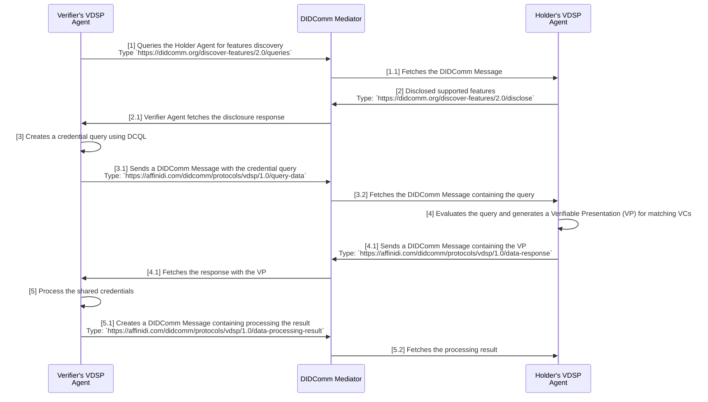

# Protocols

This document describes protocols implemented in the scope of `Verifiable Data Sharing Protocol` workflow.

## Table of Contents

- [Summary](#summary)
- [Motivation](#motivation)
- [Roles](#roles)
  - [Verifier](#verifier)
  - [Holder](#holder)
- [States](#states)
- [Security](#security)
- [VDSP Workflow](#vdsp-workflow)
- [Message References](#message-references)
  - [query-data](#query-data)
  - [data-response](#data-response)
  - [data-processing-result](#data-processing-result)
- [Other Protocols Utilised](#other-protocols-utilised)
  - [Discover Features Protocol 2.0](#discover-features-protocol-20)
  - [Report Errors or Warnings Protocol](#report-errors-or-warnings-protocol)
- [Implementation](#implementation)

## Summary

The Verifiable Data Sharing Protocol (VDSP) facilitates the secure and interoperable exchange of verifiable credentials between **Holders** and **Verifiers** using the DIDComm v2.1 protocol.

## Motivation

To enable a more secure and trusted data sharing between Holders and Verifiers using DIDComm-compatible mediators.

## Roles

There are two roles in the VDSP flow:

### Verifier

An entity that requests verifiable credentials from holders. The verifier can query holders for specific data using credential query language and verify the authenticity of the shared credentials.

### Holder

An entity that stores and controls verifiable credentials. The holder can receive data requests, filter their credentials, and share selected credentials with verifiers through a verifiable presentation format.

## States

The protocol follows the request-response pattern of message exchange, where it waits for a response from the Holder, especially when querying data.

The Verifier must send the `data-processing-result` to inform the Holder of the outcome after sharing the data.

## Security

The protocol requires message exchanges between the Verifier and the Holder to be encrypted and verifiable. The implementer must cryptographically verify the digital signatures of Verifiable Credentials (VCs) and Verifiable Presentations (VPs) shared by the Holder.

## VDSP Workflow

When initiating the data-sharing flow, it usually takes the following steps:



1. Verifier sends a message to the Holder to query supported features (`https://didcomm.org/discover-features/2.0/queries`).
2. Holder sends a message back to the Verifier with the disclosure of supported features (`https://didcomm.org/discover-features/2.0/disclose`).
3. If the desired feature is supported, the Verifier sends a message containing the credential query to request specific credentials from the Holder's digital wallet (`https://affinidi.com/didcomm/protocols/vdsp/1.0/query-data`).
4. Evaluates the credential query. If the credentials exist in the Holder's digital wallet, the wallet generates the Verifiable Presentation (VP) of the credentials. The Holder sends a message back to the Verifier containing the VP (`https://affinidi.com/didcomm/protocols/vdsp/1.0/data-response`).
5. Once the Verifier receives the response, it processes the data according to its purpose and sends the result back to the Holder (`https://affinidi.com/didcomm/protocols/vdsp/1.0/data-processing-result`).

## Message References

VDSP implements the following message types.

### query-data

Request Verifiable Credentials (VCs) from Verifier to Holder using Digital Credentials Query Language (DCQL).

**Direction:** Verifier → Holder

**Message Type URI:** `https://affinidi.com/didcomm/protocols/vdsp/1.0/query-data`

**Example:**

```json
{
  "id": "12461308-57e4-400b-a3ad-1ba3a2bf3fe2",
  "type": "https://affinidi.com/didcomm/protocols/vdsp/1.0/query-data",
  "from": "did:webvh:QmQfsx1wNZYpVxjWwMnUj16rDH2dq8UbcsC1igZMR23k9z:verifierdomain.com",
  "to": [
    "did:key:Vz6MkhA4WiEoTaSXmShG4s2mpYsWku2km2MaLq1m2g3yReZF7"
  ],
  "body": {
    "operation": "registerAgent",
    "data_query_lang": "DCQL",
    "response_format": "application/json",
    "query": {
      "credentials": [
        {
          "id": "46abedea-472e-48d3-aaff-3def8ae88e44",
          "format": "ldp_vc",
          "multiple": false,
          "require_cryptographic_holder_binding": true,
          "claims": [
            {
              "path": [
                "credentialSubject",
                "email"
              ]
            }
          ]
        }
      ]
    },
    "proof_context": {
      "challenge": "ae34c9ed-e741-4cd2-90a2-378b05004fa5",
      "domain": "verifierdomain.com"
    }
  }
}
```

In the example above, the **`query`** property adheres to the format defined in DCQL within the [OID4VP specification](https://openid.net/specs/openid-4-verifiable-presentations-1_0.html#name-digital-credentials-query-l). 

The message includes the **`proof_context`**, which contains a random challenge string and the domain of the Verifier to prevent replay attacks.

### data-response

Shares the presentation of the Verifiable Credentials (VCs) from Holder to Verifier using Verifiable Presentation (VP) format, cryptographically signed by the holder.

**Direction:** Holder → Verifier

**Message Type URI:** `https://affinidi.com/didcomm/protocols/vdsp/1.0/data-response`

**Example:**

```json
{
  "id": "13c8e304-cc5c-4a2f-90d9-cbc939bfe67f",
  "type": "https://affinidi.com/didcomm/protocols/vdsp/1.0/data-response",
  "from": "did:key:Vz6MkhA4WiEoTaSXmShG4s2mpYsWku2km2MaLq1m2g3yReZF7",
  "to": [
    "did:webvh:QmQfsx1wNZYpVxjWwMnUj16rDH2dq8UbcsC1igZMR23k9z:verifierdomain.com"
  ],
  "body": {
    "data_query_lang": "DCQL",
    "response_format": "application/json",
    "data_response": {
      "@context": [
        "https://www.w3.org/ns/credentials/v2"
      ],
      "id": "3fcdee5b-3451-4ffd-ba70-d9cc11f645b4",
      "type": [
        "VerifiablePresentation"
      ],
      "holder": {
        "id": "did:key:Vz6MkhA4WiEoTaSXmShG4s2mpYsWku2km2MaLq1m2g3yReZF7"
      },
      "verifiableCredential": [
        {
          "@context": [
            "https://www.w3.org/2018/credentials/v1",
            "https://schema.affinidi.io/TEmailV1R0.jsonld"
          ],
          "issuer": {
            "id": "did:webvh:QmQfsx1wNZYpVxjWwMnUj16rDH2dq8UbcsC1igZMR2387h:issuerdomain.com"
          },
          "type": [
            "VerifiableCredential",
            "Email"
          ],
          "id": "1c471d4e-a739-400c-a1c8-2e44a6bb524f",
          "credentialSchema": {
            "id": "https://schema.affinidi.io/TEmailV1R0.json",
            "type": "JsonSchemaValidator2018"
          },
          "issuanceDate": "2025-11-12T09:09:30.954818Z",
          "credentialSubject": {
            "id": "did:key:Vz6MkhA4WiEoTaSXmShG4s2mpYsWku2km2MaLq1m2g3yReZF7",
            "email": "user@test.com"
          },
          "proof": {
            // Removed for brevity
          }
        }
      ],
      "proof": {
        // Removed for brevity
    }
  }
}
```

In the example above, the **`data_response`** property contains the Verifiable Presentation (VP) of the shared credentials from the Holder.

### data-processing-result

After the Verifier receives the shared data and processes it, they send a response to the Holder regarding the result. 

For example, if the Holder is applying for a loan, the Verifier sends the results to the Holder, indicating whether the processing is successful.

**Direction:** Verifier → Holder

**Message Type URI:** `https://affinidi.com/didcomm/protocols/vdsp/1.0/data-processing-result`

**Example:**

```json
{
  "id": "54578387-c11f-47f9-aa86-ca68f3af6dbd",
  "type": "https://affinidi.com/didcomm/protocols/vdsp/1.0/data-processing-result",
  "from": "did:webvh:QmQfsx1wNZYpVxjWwMnUj16rDH2dq8UbcsC1igZMR23k9z:verifierdomain.com",
  "to": [
    "did:key:Vz6MkhA4WiEoTaSXmShG4s2mpYsWku2km2MaLq1m2g3yReZF7"
  ],
  "body": {
    "result": {
      "success": true
    }
  }
}
```

In the above example, the Verifier returns a success message. The content of the body is flexible where you can include additional details about the result of the processing.

## Other Protocols Utilised

The VDSP utilises existing protocols to implement the data-sharing flow from initiating the request to sharing the presentation and the results.

### Discover Features Protocol 2.0

VDSP uses the Discovery Features protocol to query the features supported by the Holder's agent. Depending on the supported features, the data sharing flow may continue or not.

The [PIURI](https://identity.foundation/didcomm-messaging/spec/v2.1/#protocol-identifier-uri) for this protocol is `https://didcomm.org/discover-features/2.0`.

#### Querying Features

```json
{
  "id": "c053ec35-cf80-4ac4-8fc4-ac63e031932a",
  "type": "https://didcomm.org/discover-features/2.0/queries",
  "from": "did:webvh:QmQfsx1wNZYpVxjWwMnUj16rDH2dq8UbcsC1igZMR23k9z:verifierdomain.com",
  "to": [
    "did:key:Vz6MkhA4WiEoTaSXmShG4s2mpYsWku2km2MaLq1m2g3yReZF7"
  ],
  "body": {
    "queries": [
      // Reduced query for brevity
      {
        "feature-type": "protocol",
        "match": "https://affinidi.com/didcomm/protocols/vdsp/1.0"
      },
      {
        "feature-type": "data_query_lang",
        "match": "DCQL"
      },
      {
        "feature-type": "credential_format",
        "match": "sd_jwt_vc"
      },
      {
        "feature-type": "credential_format",
        "match": "w3c/v2"
      },
      {
        "feature-type": "data_integrity_proof_suite",
        "match": "ecdsa-rdfc-2019"
      },
      {
        "feature-type": "data_integrity_proof_suite",
        "match": "eddsa-rdfc-2022"
      },
      {
        "feature-type": "json_web_signature_algorithm",
        "match": "ES256"
      },
      {
        "feature-type": "json_web_signature_algorithm",
        "match": "EdDSA"
      },
      {
        "feature-type": "operation",
        "match": "registerAgent"
      }
    ]
  }
}
```

#### Feature Disclosures

```json
{
  "id": "5135700e-583a-4539-9f45-f644ddbe9707",
  "type": "https://didcomm.org/discover-features/2.0/disclose",
  "from": "did:key:Vz6MkhA4WiEoTaSXmShG4s2mpYsWku2km2MaLq1m2g3yReZF7",
  "to": [
    "did:webvh:QmQfsx1wNZYpVxjWwMnUj16rDH2dq8UbcsC1igZMR23k9z:verifierdomain.com"
  ],
  "thid": "c053ec35-cf80-4ac4-8fc4-ac63e031932a",
  "body": {
    "disclosures": [
      // Reduced disclosures for brevity
      {
        "feature-type": "protocol",
        "id": "https://affinidi.com/didcomm/protocols/vdsp/1.0",
        "roles": [
          "holder"
        ]
      },
      {
        "feature-type": "data_query_lang",
        "id": "DCQL"
      },
      {
        "feature-type": "credential_format",
        "id": "sd_jwt_vc"
      },
      {
        "feature-type": "credential_format",
        "id": "w3c/v2"
      },
      {
        "feature-type": "data_integrity_proof_suite",
        "id": "ecdsa-rdfc-2019"
      },
      {
        "feature-type": "json_web_signature_algorithm",
        "id": "ES256"
      },
      {
        "feature-type": "json_web_signature_algorithm",
        "id": "EdDSA"
      },
      {
        "feature-type": "operation",
        "id": "registerAgent"
      }
    ]
  }
}
```

For more information, visit the [Discover Features Protocol 2.0](https://didcomm.org/discover-features/2.0/) documentation.

### Report Errors or Warnings Protocol

The existing Problem Reports defined within the DIDComm v2.1 protocol specification for standard reporting of any issues encountered during the data sharing flow.

The [PIURI](https://identity.foundation/didcomm-messaging/spec/v2.1/#protocol-identifier-uri) for this protocol is `https://didcomm.org/report-problem/2.0`.

```json
{
  "type": "https://didcomm.org/report-problem/2.0/problem-report",
  "id": "345e6789-e89b-12d3-a456-426614174222",
  "pthid": "123e4567-e89b-12d3-a456-426614174000",
  "body": {
    "code": "e.p.vdsp.invalid-request",
    "comment": "<DETAILS_OF_THE_PROBLEM>",
    "args": ["<FIELDS>"]
  }
}
```

For more information, visit the [Problem Reports](https://identity.foundation/didcomm-messaging/spec/v2.1/#problem-reports) section.

## Implementation

To learn more about the Verifiable Data Sharing Protocol, refer to the [VDSP for Dart](https://github.com/affinidi/affinidi-tdk/tree/main/libs/dart/didcomm/vdsp) implementation.